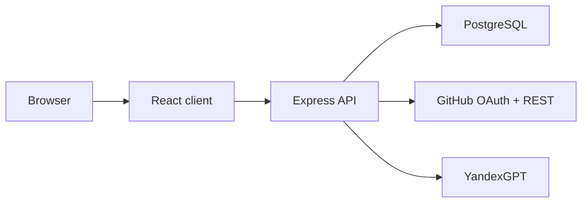

# SkillHub Architecture

## High-level view

## Responsibilities

- `client/` owns routing, forms, cards, layouts, and interaction states
- `server/` owns auth, business rules, scoring, search, teams, and applications
- `scripts/` owns seed data, smoke tests, and local tooling

## Important flows

- GitHub OAuth creates the session and also provides avatar data when available
- Profile import reads public GitHub data and stores the normalized import snapshot
- Scoring sends a compact profile payload to YandexGPT and stores the rating
- Search and teams are backed by the same server-side data model so counters stay consistent
- Closed teams stay visible only where the captain should still manage them

## Data boundaries

- UI should not calculate membership rules on its own
- server enforces closed-team, full-team, and membership-removal rules
- client reflects server state, but never treats it as the source of truth

